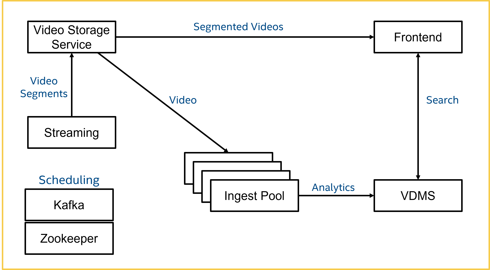

This sample implements libraries of video files content analysis, database ingestion, content search and visualization:   
- **Ingest**: Analyze video content and ingest the data into the VDMS.  
- **VDMS**: Store metadata efficiently in a graph-based database.  
- **Visualization**: Visualize content search based on video metadata.  



**This is a concept sample in active development.**   
<br>

## Software Stacks

The sample is powered by the following Open Visual Cloud software stacks:      
- **Media Analytics**:   
  - [The GStreamer-based media analytics stack](https://github.com/OpenVisualCloud/Dockerfiles/tree/v20.7/Xeon/ubuntu-18.04/analytics/gst) is used for object, face and emotion detection. The software stack is optimized for [Intel® Xeon® Scalable Processors](https://github.com/OpenVisualCloud/Dockerfiles/tree/v20.7/Xeon/ubuntu-18.04/analytics/gst).  
 
- **NGINX Web Service**:
  - [The NGINX/FFmpeg-based web serving stack](https://github.com/OpenVisualCloud/Dockerfiles/tree/v20.7/Xeon/ubuntu-18.04/media/nginx) is used to store and segment video content and serve web services. The software stack is optimized for [Intel Xeon Scalable Processors](https://github.com/OpenVisualCloud/Dockerfiles/tree/v20.7/Xeon/ubuntu-18.04/media/nginx).  
<br>

### License Obligations

- FFmpeg is an open source project licensed under LGPL and GPL. See https://www.ffmpeg.org/legal.html. You are solely responsible for determining if your use of FFmpeg requires any additional licenses. Intel is not responsible for obtaining any such licenses, nor liable for any licensing fees due, in connection with your use of FFmpeg.
<br>

- GStreamer is an open source framework licensed under LGPL. See https://gstreamer.freedesktop.org/documentation/frequently-asked-questions/licensing.html?gi-language=c.  You are solely responsible for determining if your use of Gstreamer requires any additional licenses.  Intel is not responsible for obtaining any such licenses, nor liable for any licensing fees due, in connection with your use of Gstreamer.
<br>


## Install Prerequisites:

- **Time Zone**: Check that the timezone setting of your host machine is correctly configured. Timezone is used during build. If you plan to run the sample on a cluster of machines managed by Docker Swarm or Kubernetes, please make sure to synchronize time among the manager/master node and worker nodes.    

- **Build Tools**: Install ```cmake``` and ```m4``` if they are not available on your system.        

- **Docker Engine**:        
  - Install [docker engine](https://docs.docker.com/install).     
  - Install [docker compose](https://docs.docker.com/compose/install), if you plan to deploy through docker compose. Version 1.20+ is required.    
  - Setup [docker swarm](https://docs.docker.com/engine/swarm), if you plan to deploy through docker swarm. See [Docker Swarm Setup](deployment/docker-swarm/README.md) for additional setup details.  
  - Setup [Kubernetes](https://kubernetes.io/docs/setup), if you plan to deploy through Kubernetes. See [Kubernetes Setup](deployment/kubernetes/README.md) for additional setup details.     
  - Setup docker proxy as follows if you are behind a firewall:   

```bash
sudo mkdir -p /etc/systemd/system/docker.service.d       
printf "[Service]\nEnvironment=\"HTTPS_PROXY=$https_proxy\" \"NO_PROXY=$no_proxy\"\n" | sudo tee /etc/systemd/system/docker.service.d/proxy.conf       
sudo systemctl daemon-reload          
sudo systemctl restart docker     
```
<br>


## Build Streaming Sample: 

```bash
mkdir build    
cd build     
cmake -DSTREAM_URL="udp://localhost:8088" -DIN_SOURCE=stream ..
make     
```

See also [Customize Build Process](doc/cmake.md) for additional options.    
<br>

## Start/stop Sample: 

Use the following commands to start/stop services via docker-compose:        

```bash
make start_docker_compose      
make stop_docker_compose      
```

Use the following commands to start/stop services via docker swarm:    

```bash
make update # optional for private registry
make start_docker_swarm      
make stop_docker_swarm      
```
See also:  [Docker Swarm Setup](deployment/docker-swarm/README.md). 
<br>   

Use the following commands to start/stop Kubernetes services:

```
make update # optional for private registry
make start_kubernetes
make stop_kubernetes
```

See also: [Kubernetes Setup](deployment/kubernetes/README.md).    
<br>

## Launch Sample UI:

Launch your browser and browse to ```https://<hostname>:30007```. The sample UI is similar to the following:    

</IMG>

* For Kubernetes/Docker Swarm, ```<hostname>``` is the hostname of the manager/master node.
* If you see a browser warning of self-signed certificate, please accept it to proceed to the sample UI.    
  
---

## See Also

- [Configuration Options](doc/cmake.md)          
- [Docker Swarm Setup](deployment/docker-swarm/README.md)      
- [Kubernetes Setup](deployment/kubernetes/README.md)
- [Sample Distribution](doc/dist.md)  
- [Visual Data Management System](https://github.com/intellabs/vdms)  


